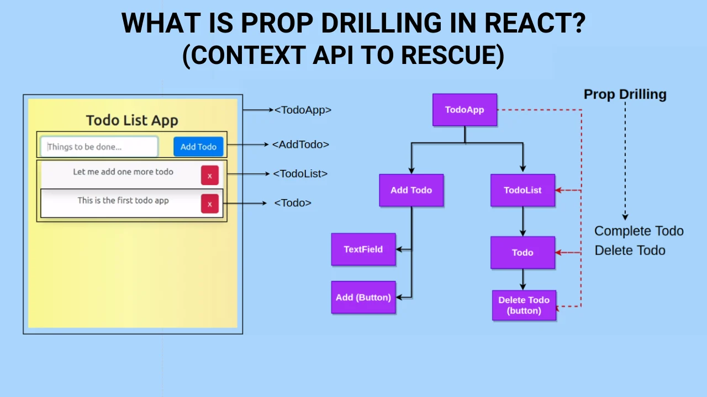

# what is context 

useContext ka kaam hota hai data ko direct kisi bhi component tak pahunchana, bina beech-beech ke components ko props dene ke.

Problem: Props Drilling 
Socho:
App → Parent → Child → GrandChild
Data sirf GrandChild ko chahiye
Lekin props sabko dene pad rahe

/* image */

# Solution: useContext

useContext bolta hai:
“Bhai data ek jagah rakh do, jisko chahiye wahan se le lo.”